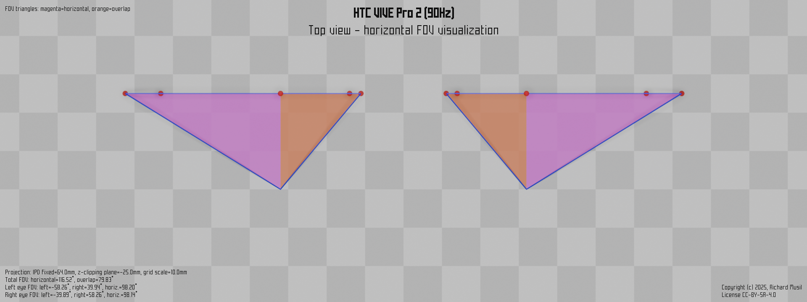
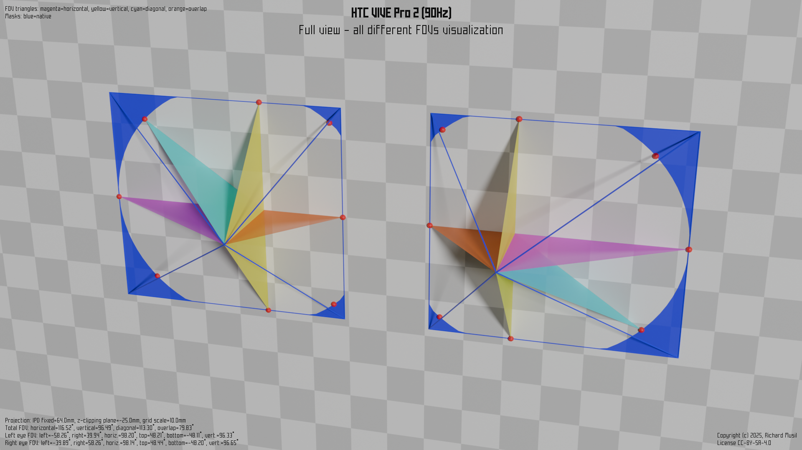

# HTC VIVE Pro 2 (90Hz)

## Geometry

as recorded and displayed by [`hmdq` or `hmdv`](https://github.com/risa2000/hmdq).
```
hmdv version 2.1.1 - displaying hmdq output data in no time

    Time stamp: 2021-06-07 00:56:04
  hmdq version: 2.1.1
Output version: 5
    OS version: 10.0.19041.985

... Subsystem: OpenVR ...

OpenVR runtime version: 1.17.14

Recommended render target size: [3224, 3224]

Left eye HAM mesh:
     original vertices: 114, triangles: 38
    optimized vertices: 45, n-gons: 4
             mesh area: 10.09 %

Left eye to head transformation matrix:
    [[ 1.      ,  0.      ,  0.      , -0.0285  ],
     [ 0.      ,  1.      ,  0.      ,  0.      ],
     [ 0.      ,  0.      ,  1.      ,  0.015   ]]

Left eye raw LRBT values:
    left:        -1.616823
    right:        0.837388
    bottom:      -1.115087
    top:          1.119002

Left eye head FOV:
    left:       -58.26 deg
    right:       39.94 deg
    bottom:     -48.11 deg
    top:         48.21 deg
    horiz.:      98.20 deg
    vert.:       96.33 deg

Right eye HAM mesh:
     original vertices: 114, triangles: 38
    optimized vertices: 45, n-gons: 4
             mesh area: 9.96 %

Right eye to head transformation matrix:
    [[ 1.      ,  0.      ,  0.      ,  0.0285  ],
     [ 0.      ,  1.      ,  0.      ,  0.      ],
     [ 0.      ,  0.      ,  1.      ,  0.015   ]]

Right eye raw LRBT values:
    left:        -0.835761
    right:        1.616455
    bottom:      -1.118511
    top:          1.128089

Right eye head FOV:
    left:       -39.89 deg
    right:       58.26 deg
    bottom:     -48.20 deg
    top:         48.44 deg
    horiz.:      98.14 deg
    vert.:       96.65 deg

Total FOV:
    horizontal: 116.52 deg
    vertical:    96.49 deg
    diagonal:   113.30 deg
    overlap:     79.83 deg

View geometry:
    left view rotation:     0.0 deg
    right view rotation:    0.0 deg
    reported IPD:          57.0 mm


```
Recorded and contributed by _JoCool_.

## Rendered FOV visualizations

Following images show different views of a rendered FOV visualization of a
particular model in a particular configuration (if there are more available).
The images are rendered to the same scale (when possible) to make them easier
to compare. The _top_, _left_, and _back_ views are rendered with an
orthographic projection to preserve the visual size over the different renders.
The overall view (_full_) uses the perspective projection. Each image is marked
with the information describing the headset configuration and the other aspects
of the image.

### Visualization rules

* Headsets which define the _hidden area mask (HAM)_ are rendered with it. The
  HAM also impacts the calculated FOV points (the red "clown noses" spread
  around the edge of the HAM or the viewing frame).

* Headsets without the HAM have the view rendered with the wireframe only, which
  visualizes the tip of the viewing frustum.

* The FOV points and the subsequent FOV triangles are calculated and visualized
  according to [these
  rules](https://risa2000.github.io/vrdocs/docs/hmd_fov_calculation).

* Viewing frustums are clipped by the _z-clipping plane_ at the same fixed
  distance, so the projected areas on the chequerboard in _back_ and _full_
  views are on the same scale and directly comparable between different
  configurations or headsets.

* For the same reason the interpupillary distance (IPD) is fixed at the same
  value for all headsets.

* Headsets which use canted views and can operate in both modes (native and
  parallel) are rendered with a green HAM projection, which shows the shape of
  the native HAM (rendered in blue) projected to the "normalized"
  (checkerboard) plane parallel to the face. Those green native projections are
  then directly comparable either to the parallel mode HAMs (rendered in red)
  of the same model, or to the native HAMs of the other (traditional) headsets
  which use only the parallel views by design and as such are also rendered
  into the parallel (checkerboard) plane.

### Top view
[](../images/VIVEPro2_Native_R90_top.dmx.png)

### Left view
[](../images/VIVEPro2_Native_R90_left.dmx.png)

### Back view
[](../images/VIVEPro2_Native_R90_back.dmx.png)

### Full view
[](../images/VIVEPro2_Native_R90_over.dmx.png)

